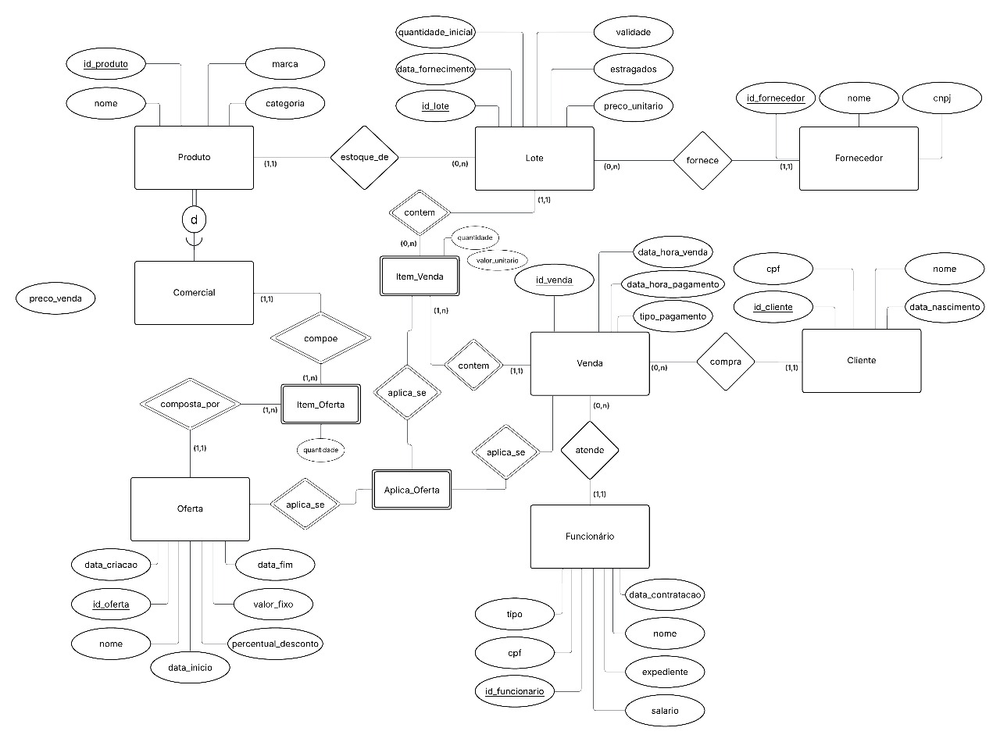

# E.D.N.A - Ecossistema D. Negociação Alcoólica

Sistema de banco de dados de Bar. Gerencie produtos, atendimentos e outras atividades do seu bar com nosso sistema.

> Esse projeto é parte do projeto final para a disciplina *Banco de Dados I*.

## Funcionalidades

1. Gerenciar o estoque, atualizando o status dos itens, seus preços e disponibilidade.
2. Buscar e filtrar itens do estoque por critérios como tipo, data de validade e fornecedor.
3. Registrar, consultar e atualizar transações de venda, gastos e cobranças.
4. Gerenciar o cadastro e o saldo devedor dos clientes.
5. Registrar e consultar gastos operacionais com recursos não comerciais, como utensílios e mobília.
6. Gerar e recuperar relatórios financeiros que apresentem ganhos, gastos e projeções para um período arbitrário.
7. Gerenciar (CRUD) o cadastro de funcionários, atribuindo cargos e outros valores.
8. Consultar e atualizar os dados de pagamento, salários e bonificações de um funcionário específico.
9. Gerar e recuperar relatórios de folha de pagamento para uma categoria de funcionários ou para a equipe inteira.
10. Gerenciar (CRUD) a criação de regras de desconto e combos promocionais.
11. Buscar e filtrar promoções por critérios como popularidade, lucratividade e data de criação.


## Tecnologias Utilizadas

A API _backend_ foi criada utilizando a linguagem **Go** (1.24). O servidor HTTP foi desenvolvido usando inteiramente a biblioteca padrão `net/http`. Enquanto o banco de dados utilizado é um banco **PostgreSQL**. Já no _frontend_, foi utilizado o framework **Vue.js** e **CSS** puro. Por último, a aplicação foi conteinerizada através de **Docker** e exposta por _reverse proxy_ **Nginx**.

## Como rodar

### Utilizando o Docker (Produção)

Antes de mais nada tenha o Docker instalado com Docker Compose. 
Configure as variáveis de ambiente em um arquivo `.env` seguindo os exemplos em `.env.example`.

Inicie os containers com o comando `docker compose up -d`. Popule a base de dados rodando as migrações com o script: `./migrate.sh up`.

> Atualize o script `migrate.sh` com a `DB_URL` e os valores corretos definidos em `.env`.
 
Feito isso, acesse o frontend através do endereço `http://localhost:80` e o backend em `http://localhost:80/api`.

> Atenção, esse modo foi pensando para ser rodado em produção. Confira a próxima seção para saber como desenvolver esse projeto.

### Em desenvolvimento

#### Backend
Configure as variáveis de ambiente em um arquivo `.env` seguindo os exemplos em `.env.example`.

Primeiro, instale a versão `1.24` da linguagem Go, a versão mais recente do Docker e Docker-compose. Em adendo para realizar as migrações é preciso instalar o `go-migrate`, você pode fazer isso com:
```sh
go install -tags 'postgres' github.com/golang-migrate/migrate/v4/cmd/migrate@v4.18.3
```

Inicie a base de dados com `make docker-run` (use `sudo` se necessário). Vá para a migração mais recente (se já não estiver) com `./migrate.sh up`, isso irá criar as tabelas no seu banco de dados (e populá-lo com dados), se quiser saber mais sobre o conceito de migrações veja a próxima seção.

Por último rode projeto com `make run`. Para rodar com _hot reloading_ (alterações serão refletidas instantâneamente) use `make watch`.

#### Frontend

Entre na pasta `frontend` com `cd frontend`. Instale as dependências necessárias com `npm install` e rode no modo de desenvolvimento com `npm run dev`.

Leia mais informações em [frontend/README.md](frontend/README.md)

### Migrações

> Migrações são scripts SQL que são rodados na base de dados e permitem criar um histórico de alterações e navegar por elas.

Não esqueça de acionar a base de dados antes de rodar migrações e de atualizar o script em `migrate.sh` com o endereço, nome de usuário e senha corretos para acessar o banco.

As migrações vivem em `migrations`. Utilize o script `migrate.sh` para gerenciar migrações. Crie novas migrações com `./migrate.sh create <migration_name>`. Vá para a migração mais recente com `./migrate.sh up`, volte **uma** migração com `./migrate.sh down 1`. Veja mais comandos em `./migrate.sh help`. 

A ferramenta de migrações utilizada é o [go-migrate](https://github.com/golang-migrate/migrate).


## Diagrama Conceitual

Segue um Diagrama Entidade Relacionamento da Aplicação em Banco de Dados.



## Licensa

Esse projeto está sob a [GNU General Public License v3.0](https://spdx.org/licenses/GPL-3.0-or-later.html). O uso e distribuição é permitido desde que siga as restrições impostas pela [LICENSA](./LICENSE).
